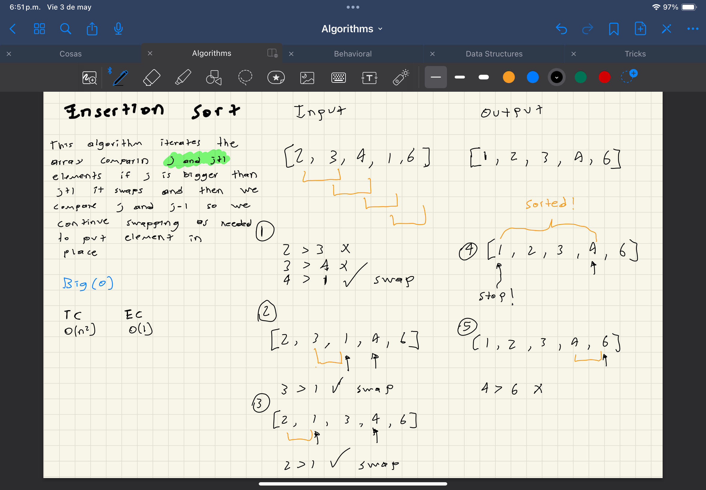

# Overview

This algorithm iterates 2 by 2 from the beginning of the array to the last
comparing `i and i+1` if `i` is bigger then swap, and this will go on until we found `i+1` that not only is lower than `i` but is lower than the other elements previous to that one, so here we will iterate backwards 2 by 2 swapping the elements needed until this element is ordered

# Big(o)

| Time Complexity | Space Complexity |
| --------------- | ---------------- |
| O(n^2)          | O(1)             |

# Stable?

Yes

# Visual

