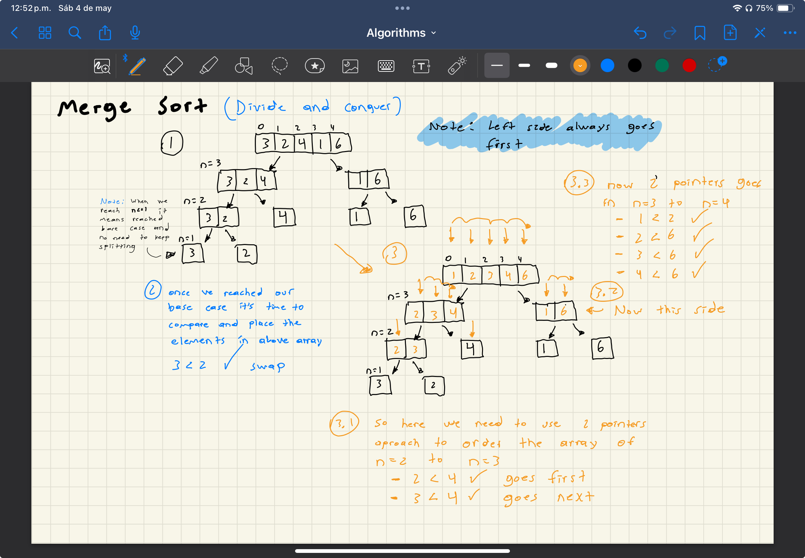

# Overview

This algorithm use `divide and conquer` strategy to literally divide the array in half each time until we got an array of length = 1 thats what we call `base case` once we reached this point we can merge all the `base-cases` to the original array in order, we achieve this by comparing all the base cases from left to right, and then we start placing them in above arrays

# Big(O)

| Time Complexity | Space Complexity |
| --------------- | ---------------- |
| O(nlogn)        | O(n)             |

Merge sort does allocate a new space in memory at the time we split the array in halfs and then re-join them in a new array

# Stable

Not really but it can be done

# Visual

