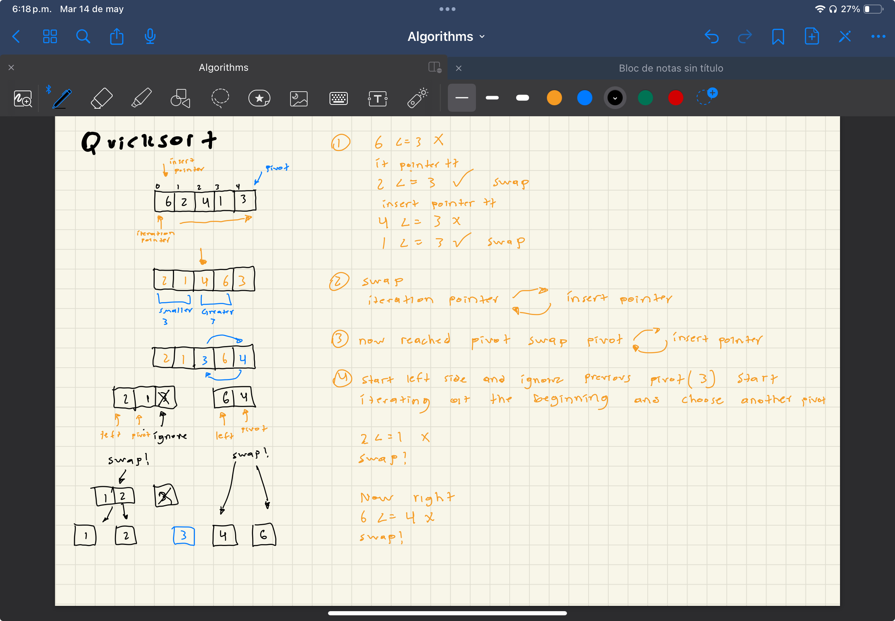

# Overview

The idea behind quicksort is to pick an element of the array which is called the pivot, and partition the array such that every value to the left is less than or equal to the pivot and every value to the right is greater than the pivot.

# Big(O)

| scenario | Time Complexity | Space Complexity |
| -------- | --------------- | ---------------- |
| Best     | O(nlogn)        | O(1)             |
| Worst    | O(n^2)          | O(1)             |

Quicksort performs the ordering in order so we dont need to allocate extra memory

# Stable

Quicksort `is not` a stable algorithm because it exchanges non-adjacent elements.

# Visual

